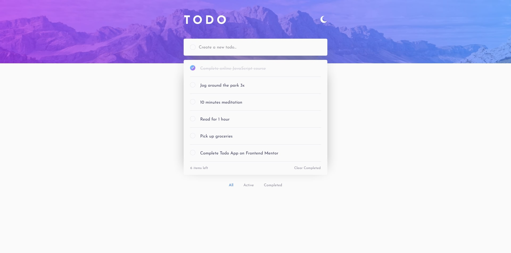

# Frontend Mentor - Todo app solution

## Table of contents

- [Overview](#overview)
  - [The challenge](#the-challenge)
  - [Screenshot](#screenshot)
  - [Links](#links)
- [My process](#my-process)
  - [Built with](#built-with)
- [Author](#author)

## Overview

### The challenge

Users should be able to:

- View the optimal layout for the app depending on their device's screen size
- See hover states for all interactive elements on the page
- Add new todos to the list
- Mark todos as complete
- Delete todos from the list
- Filter by all/active/complete todos
- Clear all completed todos
- Toggle light and dark mode

### Screenshot

### Links

- Live Site URL: [Add live site URL here](https://your-live-site-url.com)

## My process

### Built with

- HTML5
- CSS
- JavaScript

## Author

- Website - [Personal Portfolio](https://ekizashvilit.github.io/personal-portfolio/)
- LinkedIn - [Teona Ekizashvili](https://www.linkedin.com/in/teona-ekizashvili-ba5725239/)
- Twitter - [@ekizashvilit](https://twitter.com/ekizashvilit)
